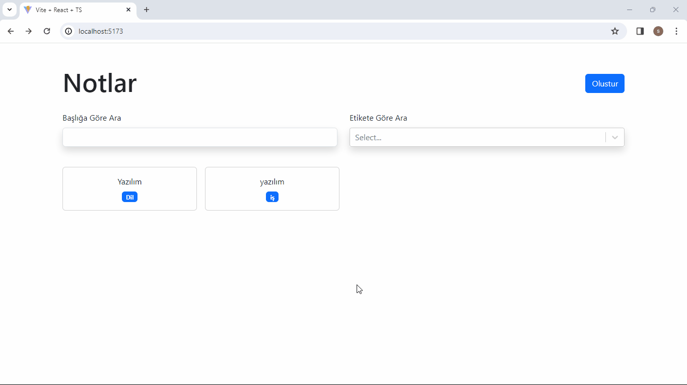

<h2>Crud Note App Project</h2>

It is a Crud app project that I created using React-Typescript.
This project has the features of adding, editing and deleting any notes you want. You can also re-edit and save the saved notes from the editing page.

<h3>Technologies Used</h3>

HTML, CSS, TypeScript, JavaScript technologies were used in this project.

<h3>Libraries Used</h3>

- react-router-dom
- react-select
- uuid
- react-markdown
- react-bootstrap
- bootstrap

<h4>Screenshot of the project.</h4>

